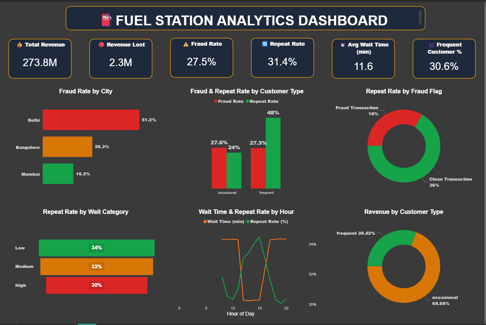
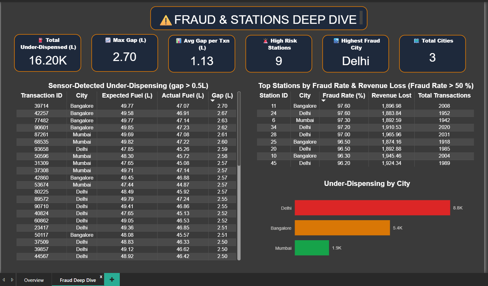

# ⛽ FuelGuard — Fraud Detection & Customer Analytics Pipeline

[](https://python.org)
[](https://postgresql.org)
[](https://powerbi.microsoft.com)
[](LICENSE)

> **"Every litre of fuel that goes unaccounted for is money stolen from the customer — and this project was built to catch exactly that."**

---

## 🧩 The Problem

Imagine paying for 50 litres of fuel but only getting 47.

That's exactly what **sensor-based fraud** looks like at fuel stations — pumps that are deliberately calibrated to under-dispense, while billing customers for the full amount.

The questions this project set out to answer:

- 📍 **Where** is fraud concentrated — which cities, which stations?
- 👥 **How** does fraud affect customer trust and repeat visits?
- ⏱️ **Does** long wait time push customers away?
- 🔬 **Can** sensor data physically prove under-dispensing?

---

## 🖥️ Dashboard Preview

### Page 1 — Overview


### Page 2 — Fraud & Stations Deep Dive


---

## 🔍 What I Found

After analyzing **1,00,000 transactions** across **50 stations** in **3 cities**, here's what the data revealed:

| Finding | Insight |
|---------|---------|
| 🔴 Delhi fraud rate | **51.2%** — highest among all cities |
| 🚨 High-risk stations | **9 stations** with 96%+ fraud rate identified |
| ⛽ Fuel stolen | **16,200 litres** physically under-dispensed |
| 📉 Trust impact | Fraud customers return at **half the rate** (18% vs 36%) |
| ⏱️ Wait time effect | Every wait category increase drops retention by ~2% |

---

## ✅ Hypotheses — All 3 Proved

This project wasn't just exploratory — it was hypothesis-driven, like real business analytics.

| # | Hypothesis | Verdict | Evidence |
|---|-----------|---------|---------|
| H1 | Fraud reduces customer repeat visits | ✅ **Proved** | Fraud txns: 18% vs Clean: 36% repeat rate |
| H2 | Higher wait time = lower retention | ✅ **Proved** | Low: 34% → Medium: 33% → High: 30% |
| H3 | Frequent customers retain better | ✅ **Proved** | Frequent: 48% vs Occasional: 24% |

---

## 🏗️ How It Was Built

This is a **complete end-to-end analytics pipeline** — not just a dashboard.

```
Raw Idea
   ↓
Data Simulation (Python)         ← Realistic fraud patterns, peak hours, customer behavior
   ↓
Data Storage (PostgreSQL)        ← 4 tables, normalized schema, 10+ SQL queries
   ↓
Exploratory Analysis (Python)    ← Hypothesis validation, sensor fraud detection
   ↓
Interactive Dashboard (Power BI) ← 2-page premium dashboard, DAX measures, data model
```

---

## 🛠️ Tech Stack

| Layer | Tool | What I Did |
|-------|------|-----------|
| Data Generation | Python (Pandas, NumPy) | Simulated 1,00,000 transactions with realistic fraud & retention logic |
| Storage & Querying | PostgreSQL | Designed schema, wrote 10+ analytical SQL queries |
| Analysis | Python (Matplotlib) | EDA, hypothesis testing, sensor fraud detection |
| Visualization | Power BI + DAX | Built 2-page interactive dashboard with 5-table data model |

---

## 📊 Dataset

| Table | Records | Key Columns |
|-------|---------|------------|
| transactions | 1,00,000 | fraud_flag, fuel_diff, wait_time, repeat_customer |
| customers | 5,000 | customer_type, signup_date |
| stations | 50 | city, fraud_prone_flag, quality_score |
| sensor_data | 1,00,000 | expected_fuel, actual_fuel, gap_liters |

**Cities:** Delhi • Mumbai • Bangalore

> 📝 Data is synthetically simulated using Python with seed-controlled randomness for reproducibility.

---

## 📂 Project Structure

```
fuel-analytics-fraud-detection/
│
├── 📁 data/                          # Raw datasets
│   ├── transactions.csv              # 1,00,000 transactions
│   ├── customers.csv                 # 5,000 customers
│   ├── stations.csv                  # 50 fuel stations
│   └── sensor_data.csv               # Sensor readings
│
├── 📁 notebooks/
│   └── fuel_station_analytics.ipynb  # Full pipeline — simulation to EDA to export
│
├── 📁 sql/
│   └── fuel_station_analysis_queries.sql  # 10+ business queries
│
├── 📁 dashboard/
│   └── fuel_dashboard.pbix           # Power BI dashboard
│
├── 📁 images/                        # Dashboard screenshots
│   ├── overview.png
│   └── deep_dive.png
│
├── requirements.txt
└── README.md
```

---

## ⚙️ How to Run

**1. Clone the repo**
```bash
git clone https://github.com/aditya-datahub/fuel-analytics-fraud-detection.git
cd fuel-analytics-fraud-detection
```

**2. Install dependencies**
```bash
pip install -r requirements.txt
```

**3. Run the notebook**
```bash
jupyter notebook notebooks/fuel_station_analytics.ipynb
```

> ⚡ Running the notebook auto-generates:
> `sensor_fraud_mixed.csv` • `sensor_fraud_all.csv` • `stations_summary.csv`

**4. Open Power BI**

Open `dashboard/fuel_dashboard.pbix` in Power BI Desktop and refresh data sources.

---

## 📋 Requirements

```
pandas
numpy
matplotlib
psycopg2-binary
```

---

## 👤 Author

**Aditya Sharma** — Data Analyst

[](https://www.linkedin.com/in/aditya-sharma-9b6588286/)
[](https://github.com/aditya-datahub)

---

## 📄 License

This project is licensed under the [MIT License](LICENSE).

---

<div align="center">

**⭐ If you found this project useful, consider giving it a star!**

</div>
